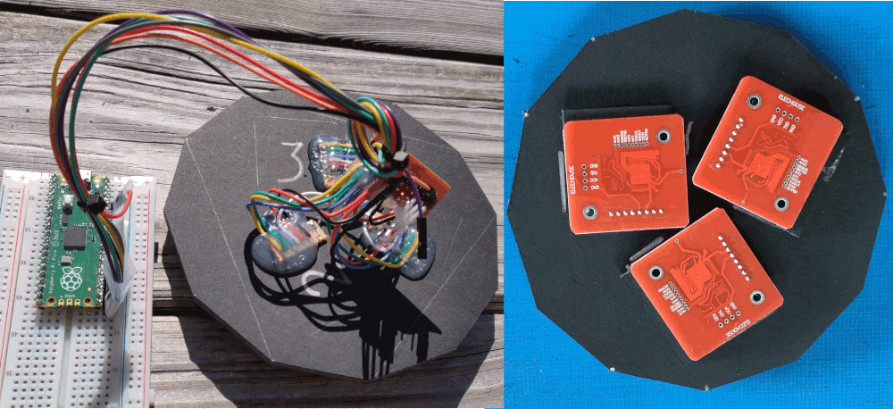

# itchy-o/rfid_experiment/test2

This experiment is to determine how many RFID tags are need per floor area
(i.e.: the "tag density").

The requirement is to "always" have a tag being sensed (to some positional tolerance),
so the sensor doesn't get lost in-between tags.
The tags are inexpensive but not free, so there is motivation to minimize the tag
density to keep costs down.
The tag cost could be significant for position sensing in a large room.

The sensor consists of a circular foamcore "sensor deck" with three PN532 RFID sensors
arranged in an equilateral triangle with radially-symmetric orientation for areal coverage.
The sensors are packed snuggly without overlapping.
The resulting center-to-center spacing of the three sensors is 52, 49, 50 mm, for a
triangular area of 1095 mm^2



The circuit consists of a
[Raspberry Pi Pico MCU](https://www.raspberrypi.com/products/raspberry-pi-pico/),
running [CircuitPython 8](https://circuitpython.org/),
connected to three [PN532 RFID sensor boards](https://www.ebay.com/sch/i.html?_nkw=pn532)
using SPI.  Data is reported via Pico's USB serial port.

## Wiring
```
PN532                deck    cable   pico    pico    pico
signal   direction   color   color  signal   pin     gpio
======= =========== ======= ======= ======= ======= =======
 sck        <--       yel     wht    sck      24     GP18
 miso       -->       grn     gry    rx       26     GP20
 mosi       <--       blu     vio    tx       25     GP19
 vcc        <--       red     blu    3v3out   36     ---
 gnd        ---       blk     grn    gnd      23     ---
 ss1        <--       wht     ora    cs       22     GP17
 ss2        <--       wht     red    cs       27     GP21
 ss3        <--       wht     brn    cs        7     GP5
```
